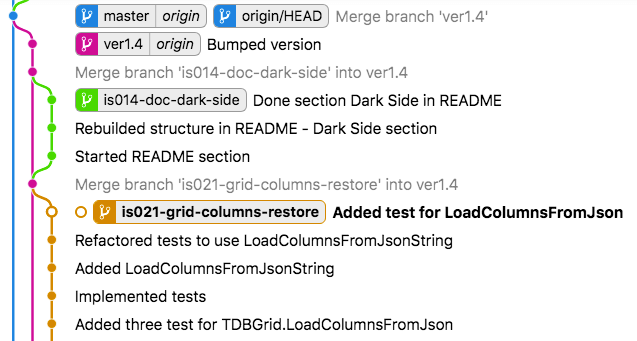
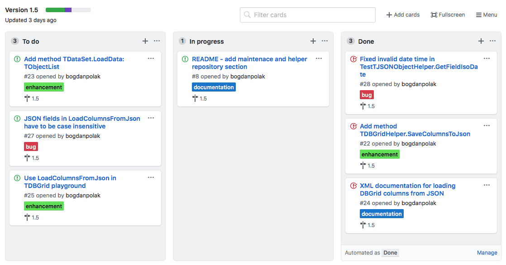

# Repository of VCL and RTL Class Helpers


## Why use Class Helpers?

### 1. Safe cleaning technique

The huge amount of VCL (FMX) code can be cleared using class helpers, which are actually an easy refactoring technique with low risk for complex projects. Using this method, teams can start upgrading their legacy projects even without unit tests safety net. Moreover the verification of newly created helpers can be easily done with unit tests. This approach allow to teach developers how to write unit tests in a correct way (learn in practice F.I.R.S.T principles or other). Teams can also easily applay TDD development process (write tests first and then implement functionality) in a fun and non-invasive way.

Sometimes class helpers could be also dangerous if they are used improperly. For this reason it is required to apply a little more disciplined development and delivery process, suggestions connected with that area are covered in the following sections. 

Class helpers benefits:

- **Extract global functions** - global functions and utility methods wrote straight in forms (modules) can be extracted and reuse, also they can grouped together in separated containers based on subject class, finally they can be covered with unit tests
- **Reduce size of events** - size of code in events (forms, frames and data modules) can be significantly decreased, which helps to improve code readability, especially when valuable business code is  mixed together with visualization or with component processing
- **Improve utility code readability** - it is available by removing one of the function parameter which is a call subject (see bellow "Subject first" sample), together with that small improvements we are able to remove flags from calls, use more meaningful names, compress conditional sequences, make complex things simpler and safer
- **Introduce TDD approach**. - class helpers should be autonomous and not dependent on project's business code, thanks of that are  easy to cover with unit tests, then can be expanded using TDD development (red-green-refactor) which is really helpful here

Sample code - Subject first: first line is classic call and second is written using class helper *(which one is more readable?)*:

```pas
// classic call:
StoreDataset (rsChanged, 1, mysqlDataSet, true);

// improved class:
mysqlDataSet.StoreRows_ThenUpdateData_StopAfterFirstError(rsChanged);
```

### 2. Private fields/methods lock-pick (now not available)

From the very beginning (Delphi 2006) till Delphi Berlin / 10.1 version there was quite popular class helper bug, which allows to access private fields and private methods using helpers. Because of this bug many developers identified this interesting language extension with such hack. The misuse of class helpers has caused that value of this super powerful solution is underestimated. 

## Helpers

| Helper name | Expanded class | Information |
| --- | --- | --- |
| TApplicationHelper | TApplication | concept solution for storing general reusable functions  |
| TDataSetHelper | TDataSet | extension function for data manipulation and storage |
| TDateTimeHelper | TDateTime | sample record helper  |
| TDBGridHelper | TDBGrid | expanding classic DBGrid |
| TJSONObjectHelper | TJSONObject | function manipulating on JSON memory DOM |
| TStringGridHelper | TStringGrid | more advanced features added to StringGrid control |
| TWinControlHelper | TWinControl | utility methods available for all TWinControl descendants (TForm, TPanel, etc.)  |

[Full helper catalog](https://github.com/bogdanpolak/class-helpers/tree/master/src)


## Unit testing

One of the important purposes of using class helpers is to learn how to write unit tests. This repository contains a sample DUnitX test project for the included helpers. I encourage to start analyzing this collection from opening and executing this project. Unit test sets can be easily expanded to provide better (tighter) test coverage. To have better unit testing experience I suggest to install the best TDD Delphi IDE extension: [TestInsight](https://bitbucket.org/sglienke/testinsight/wiki/Home) - very productive platform of working with unit test project (glory to the author! Stefan Glienke).

Sample unit test can be found in `tests` repository folder. [Jump to this folder ...](https://github.com/bogdanpolak/class-helpers/tree/master/tests)

Sample test of `TStringGrid` class helper `ColsWidth` method:

```pas
procedure TestTStringGridHelper.FiveColumns_ColsWidth;
begin
  fGrid.ColCount := 5;
  fGrid.ColsWidth([50, 100, 90, 110, 80]);
  Assert.AreEqual(110, fGrid.ColWidths[3]);
  Assert.AreEqual(80, fGrid.ColWidths[4]);
end;
```

## Good practices

Class helpers looks really promising in the begging and actually there are great solution, but as you create and use more and more of them, you'll start to notice some obstacles. For this reason, good practices should be adapted from the beginning to help avoid potential problems.

1. **One helper for one class (in whole project).** It's possible to declare two class helpers with different methods extending the same class. Although they cannot be used together in one unit (only one of them will be visible), but such code can be compiled. You can potentially use two different helpers in separate units, but you shouldn't do that because it can be dangerous and generate difficult to fix bugs.
1. **Unified collection of helpers.** Try do keep consistent and unified collection of class helpers. The best solution is created separate repository (more details in the following section). At first, helpers may be part of the main business project, but it is better to isolate them, especially when you plan to reuse them in many projects. Helpers should be treated as independent components that have been tested and implemented in the final project.
1. **Use only when necessary.** Do not declare class helpers for your classes, which can be easily extend using classic OOP methods, such as inheritance, polymorphism and composition. Helpers are really useful for extending the functionality of RTL, VCL or FMX classes. They can also be successfully used to extend third-party components. The added functionality should be domain independent and easy to reuse in various projects.
1. **Define as close as possible.** The class helper should be defined as close to the used class as possible. The VCL framework has very expanded inheritance tree and in some cases developer can define expanding method for more general class (like TWinControl) or for more specialized one (like TGroupBox). From usage perspective, it is much better to expand specialized classes then general: it could be more difficult to figure out which helper unit has to be included (added to uses section) after coping existing code into a new unit. When helper is defined for the same class which is actually used this is not a problem.
1. **Define release cycle.** A project with helpers should be treated as an independent product. As a consumer the developer should be aware of helpers version which he is using now and about possible available updates. More information you can find in Maintenance section.

## Helpers maintenance

 One of the recommended practices when using class helpers is to plan good  project maintenance, including version control and release management. Proven steps including two important point: 

1. **Independent project** - class helpers should be maintained as a separate project, versioned and merged into finial projects like other external packages.
1. **Helpers release cycle** - class helpers project should have releases with defined version numbers and dates. Which makes it necessary to build an independent branching model in the repository. New helpers release can be tested before deploy and then integrated with final projects at the right time. Such integration can be simple or a little more difficult depending on the number of breakthrough changes.

This GitHub project is live example of such deployment techniques. We are using branching model inspired by Vincent Driessen blog post: [A successful Git branching model](https://nvie.com/posts/a-successful-git-branching-model/) together with planing and delivery model inspired by Kanban method.

**Class helpers project branching model**



* Green and brown branches are feature branches, which are temporary one
   - first one (brown) `is021-grid-column-restore` is for new feature: method `LoadColumnsFromJsonString` in TDBGrid class helper, which allows to restore column configuration (order, title caption, width and visibility) stored in JSON string. Feature definition is written in [GitHub Issue #21](https://github.com/bogdanpolak/class-helpers/issues/21)
   - second one (green) `is014-doc-dark-side` is new documentation section in main `README.md` file. 
* Violet branch is version (release) branch, which is long-life one 
   - Feature branches are merged into version when feature is ready to deliver. Developers shouldn't commit changes direct into version branch. In this example only final changes - before release are approved in violet branch
* Blue branch is master branch, which is infinite one
   - No direct changes are allowed on this branch and this is production branch

**Class helpers project Kanban board**



Kanban board and planning sessions are suggested techniques to achieve - incremental delivery. Class helpers project can't be delivered too often, because of integration cost (integration class helper repository with final Delphi projects). And from the other side delivery of the new version shouldn't take too long, because all projects should use advantages of new helpers (high reusability).

## The Dark Side of class helpers

Class helpers are look really nice on the first contact, but they have some dangerous side effects. In this section you able to better understand the weaknesses of this solution. If you try to define two class helpers expanding the same base class you will see that only one of them will be visible. More to that you are not able to expand class helper functionality with inheritance. Also you are not able to define additional memory (fields) in the class helper.

You can protect your project against the effects of these weaknesses. Before defining a new class helper you should ask yourself a few questions:

1. Better alternatives.
   - Q: **Is not possible to introduce expected functionality within a new class?** 
   - Definition of a new class is better approach, easier to understand and more popular, all dependencies should be inject to this class and whole composition should be easy to decouple into independent units.
   - A class helper could be a temporary solution during code refactoring (when developer is not sure about the responsibilities of the new class).
1. Where to define class helper
   - Q: **Which VCL / FMX or RTL classes should be chosen as a base for helper?**
   - The class helper should be defined as high in the component hierarchy as possible. After copy existing code into a new unit developer could be not able to compile it (receiving compiler error: *Undeclared identifier* for some method of a class). In that case the developer should be aware that he needs to add unit with class helper definition expanding this class to the uses section. It's is easy to fix this compiler error if helper is defined for actually used class. Otherwise developer has to check one by one more general (in inheritance chain) classes.
   - If this is possible define helper for specialized classes (`TButton`) not for more general (`TControl`, `TComponent`, etc.).
1. Extra cost - time
   - Q: **Are you able to spend extra time on maintaining helpers?**
   - Usually class helper are added as the supporting code together with more general tasks. This is OK, but after closing this task you need to spend some extra time on extracting this helper and adding it into helper repository
1. Version
   - Q: **What version of the helpers class project is being used now?**
   - Application should be using the most recent version of helpers, but migration from previous one to most recent one could cost some time, and have to be plan accordingly.
1. Unit test coverages
   - Q: **Are you able to write unit tests for class helper methods?**
   - Class helpers should be well documented and achieve the highest possible quality. Bugs inside class helpers could be really confusing for the developers